##  index 

---
1. [Event Driven MicroService](#event-driven-microservice)
2. [CQRS Pattern](#cqrs-pattern)
3. [동기, 비동기 통신](#동기-비동기-통신)
---

# Event Driven MicroService
## Event Driven?

- Event Driven 아키텍처는 특정 서비스에서 다른 서비스가 관심을 가질 수 있는 작업을 수행할 때 해당 서비스는 이 작업을 이벤트로써 **이벤트 스토어(메세지 Queue)** 에 **기록(발행)**
- 다른 서비스는 기록된 이벤트들을 **구독**, 자신들(MicroService)의 작업을 수행

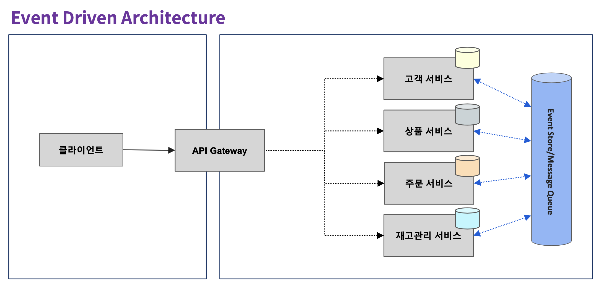

## Event Store
이벤트 스토어는 시간이 지나도 이벤트를 지속하고 관리하는 데 사용되는 데이터베이스 또는 저장소 메커니즘

- 대표적인 기술로 **Apache Kafka**와 이벤트 저장 및 검색에 최적화된 전문 이벤트 소싱 데이터베이스나 **Axon 프레임워크**와 같은 이벤트 소싱 라이브러리가 있음
- **이벤트 소싱 패턴**을 구현하여 시스템 내 상태 변경의 전체 이력을 캡처하여 이벤트의 감사 가능성, 재생 가능성 및 시간별 쿼리(추적 및 모니터링)를 가능하게 함

## 이벤트 처리 방식
**[ 대기열(Queue) 방식 - Point to Point ]**

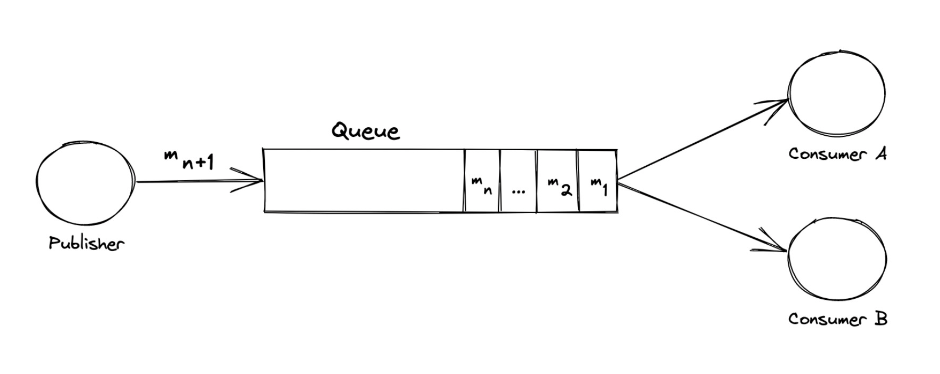

대기열 방식은 최초 Consumer가 가져간 메세지는 다른 소비자가 가져갈 수 없음 (**소비의 개념**)

- 여러 작업자에게 작업을 분산시켜야 하고 중복 처리를 피하려는 시나리오에 유용
- 예시) 주문처리 마이크로서비스 - 모든 주문은 한 번만 처리되어야 함 (중복방지)

**[ 토픽(Topic) 방식 - Pub-Sub ]**

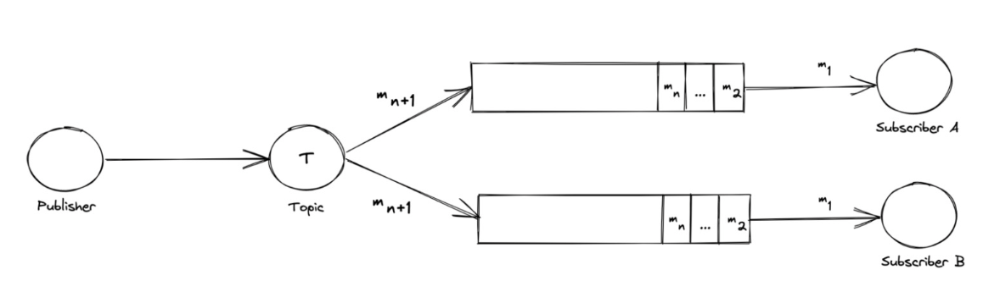

Pub-Sub은 모든 구독자(subscriber)들이 메세지를 최소 1번 이상(복제본) 가져갈 수 있음

- 동일한 유형의 이벤트에 관심이 있는 여러 소비자에게 이벤트를 브로드캐스트해야 할 때 적합
- 예시) 소셜플랫폼의 구독(팔로우)서비스 - 새 트윗, 새 게시물 구독자 알람

**모든 consumer들이 모든 메세지를 전부 수신해야하는가?**

- No → 대기열(Queue) 방식
- Yes → Pub-Sub 방식

## 대표적인 Event Broker (Message Broker)

**Rabbit MQ**

- 가장 범용적이고, 널리 사용되는 오픈소스 **Message Queue 방식의 메세지 브로커**
- **강력한 메세지 라우팅 기능, Queue의 다양한 옵션 설정**

**Amazon SQS / SNS**

- 메세지 브로커를 설정할 필요없는 **단순 대기열(queue)과 주제(topic) 서비스(SaaS)**
- **단순히 Queue 용도**로만 사용할 경우 적절한 대안이 될 수 있음. (AWS 인프라에 최적화)
- 메세지 라우팅 기능, 채널 그룹핑 기능 없음

**Apache Kafka**

- 범용 메세지 브로커중에서는 가장 뛰어난 성능, **대표적인 Pub-Sub(Topic) 기반 기술**
- 통신 프로토콜이 TCP/IP 방식임. **대용량 트래픽** 처리 목적, **파티셔닝 등의 분산기능** 제공
- **최소 1번의 메세지 전송 보장, 파일 기반 메세지 로그 저장**

## Zero-Payload 방식

Zero-Payload 방식은 이벤트 전송처리 방식의 하나로 이벤트 메시지의 **페이로드 크기를 최소화**하는 것을 목표로 하는 디자인 패턴

- 이벤트 자체 내에 실제 데이터를 포함해서 전달하지 않는게 포인트
- 이 접근 방식은 이벤트의 기본 목적이 해당 변경에 대한 자세한 정보를 전송하는 것이 아니라 **특정 작업이나 변경이 발생**했음을 알리는 것이라는 원칙을 활용

**[ 핵심 원칙 - Core Principles ]**

**✔️ Event Notification**

- 이벤트는 시스템에서 중요한 일이 발생했음을 알리는 알림으로만 사용됨
- 이벤트 자체에 대한 자세한 데이터는 포함되어 있지 않지만 **변경, 유의미한 작업의 발생**을 나타냄

**✔️ Decoupling**

- 이벤트 생산자(Publisher)와 이벤트 소비자(Subscriber)는 **시스템적으로 분리**됨
- 생산자는 **이벤트 발생을 알리는 책임**만 가지고, 소비자는 **필요한 데이터를 독립적으로 요청, 획득할 책임**을 가짐

**✔️ Data Retrieval**

- 이벤트가 수신되면 소비자는 Source System이나 Database에서 실제 필요한 데이터를 요청

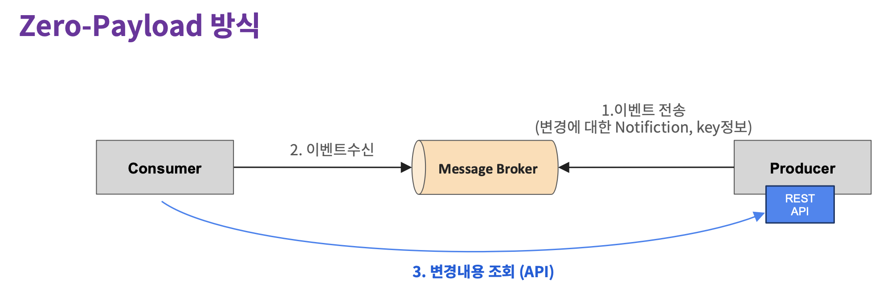

- 메세지 발행자는 변경 시 모든 데이터를 보낼 수 없음 (필요X) - 구독자마다 요구하는 DataSet이 다름
- 구독자(소비자) 서비스는 이벤트 수신 시점 약속된 API로 조회, 필요한 데이터만 수신 → 반영

1. **이벤트 생성**
    1. 새로운 게시글 생성 등 중요한 작업 발생 시 게시자(Publisher)에 의해 이벤트가 생성
    2. 이벤트에는 **최소한의 정보**만 포함. **고유 식별자**와 **이벤트 유형** 또는 **이름만 포함**하는 형태로 생성
2. **이벤트 전달**
    1. 이벤트는 메시지 브로커로 전달되어 해당 이벤트에 관심 있는 구독자에게 전달
    2. **Payload가 최소화**되어 전송이 효율적이고 대역폭과 저장 공간을 절약할 수 있음
3. **이벤트 처리**
    1. 구독자가 이벤트를 수신하면 **이벤트 유형** 및 **고유 식별자** 추출
    2. 구독자는 관련 데이터 소스(데이터베이스 또는 API)로 부터 실제 **필요 정보** 얻어옴

**[ 고려사항 ]**

Zero-Payload 방식은 페이로드 크기를 최소화하며, 책임을 분리하기 때문에 **효율성, 데이터 최신화, 단순성, 분리 및 확장성** 이라는 장점을 가지지만 이로인해 반대로 고려해야되는 사항들도 존재한다.

**✔️ 지연시간** (Latency)

- 데이터 요청 단계의 추가로 **지연시간**이 늘어날 수 있음. 이는 **데이터 소스가 느리거나 로드가 많은 경우** 성능에 영향을 줌. 특히 **시간에 민감한 애플리케이션**에서는 이 특성을 충분히 고려해야 함

**✔️ 데이터 검색(최신화)의 복잡성** (Complexity in Data Retrieval)

- 소비자는 여러 소스에서 데이터를 가져오고 집계해야 하는 복잡한 비즈니스 로직을 구현해야 할 수 있음
- **데이터 검색의 복잡성**이 소비자 애플리케이션의 복잡성에 영향이 없는 수준에서의 활용을 검토

**✔️ 종속성** (Dependency on Data Sources)

- 별도의 데이터 요청 처리에 따른 **데이터 소스의 가용성과 성능에 의존성을 가지게 됨**

**[ 적용 사례 - 배달의 민족 가게 / 업주 정보 변경 ]**

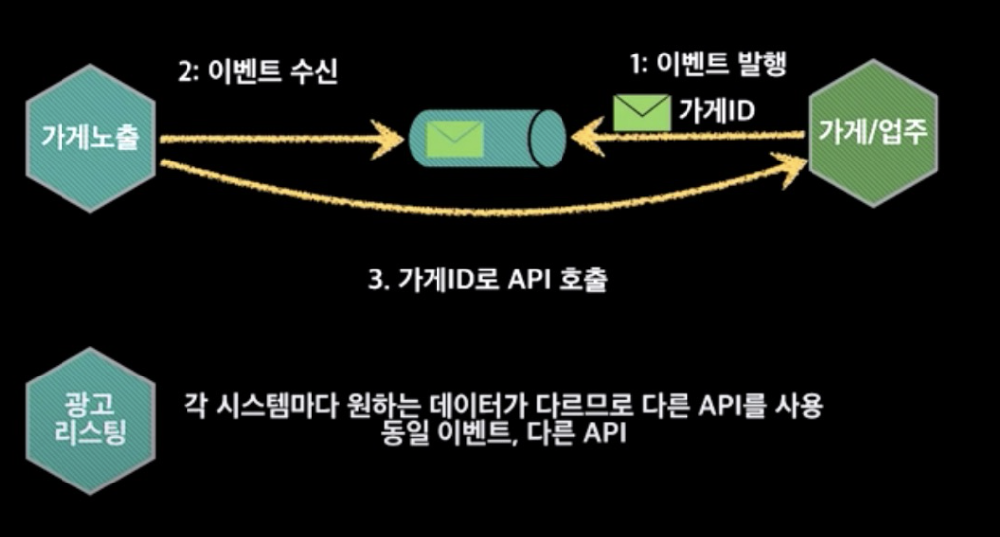

**가게 정보의 변경 이벤트 발행**

- 메뉴의 추가, 가격 변동 등 가게의 주요 변경 사항을 이벤트로 발행
- 이벤트는 **가게 ID(식별정보)와 이벤트 유형만 포함**

**가게 노출 서비스는 변경 이벤트 수신**

- 가게 ID로 약속된 API 호출. **가게 노출 서비스에 필요한 정보 수신**

**광고 서비스도 동일 이벤트 수신**

- 가게 ID로 약속된 다른 API 호출. **광고 서비스에 필요한 정보 수신**

## 그래서! 왜 이벤트 주도(Message-Driven) 방식이 필요한가?

- 상대 시스템의 성능, 서버 상태에 영향을 받지 않는다.
- 상대 시스템은 서로 독립적으로 인스턴스를 증가 및 감소할 수 있다.
- 상호 정보 교환을 하는 시스템들은 서로가 어디에 위치하는지(endpoint가 어디인지), 어떤 기술 기반인지 관심을 가질 필요가 없다. 서로 시스템 정보를 몰라도 이벤트(메세지) 교환이 가능하다.
- **오로지 메세지 전송(Pub)과 수신(Sub)에만 관심을 가지면 된다.**
- **이런 느슨한 결합이 가능하므로 분산시스템, 마이크로서비스간 협업 관계이 있어 Event Driven 방식은 필수라 할 수 있다.**

## Event Driven MicroService

EDM은 MSA가 적용된 시스템에서 **이벤트** 발생 시 해당 **이벤트 로그를 보관**하고 서비스들은 이를 기반으로 동작하며, **비동기 통신**을 통해 시스템 내 통합을 수행하는 아키텍처

- **이벤트** - 상태의 변경(CUD), 서비스의 의미있는 변화 (예 - 주문 생성, 주문 취소, 출고 완료, 배송 완료)
- **이벤트 로그의 보관** - 상태 변경의 누적, 생성된 이벤트는 반드시 보관되어야 함. **현재의 상태를 구성하는 근간**
- **비동기 통신** - 서비스간 이벤트 로그의 전달 및 수신, MQTT, AMQP 등의 **메세징 프로토콜 기반 기술 사용**

## 이벤트-주도(Event-Driven) 데이터 관리

1. EDM에서 이벤트는 **데이터의 생성, 변경, 삭제**로 정의
2. 이벤트가 발생하면 **이벤트 스토어**에 보관하고 **메세지 큐**를 통해 발행
3. 해당 이벤트에 관심이 있는 서비스에서 구독 후 정해진 비즈니스 로직을 수행
4. **보관된 이벤트 기록은 장애 또는 특정 요구사항에 따라 데이터를 복원하는데 사용 (이벤트 로그 기반으로 Roll-back 수행)**
5. **위 1, 2, 3의 과정과 이벤트 기반 복원을 통해 최종적인 데이터의 일관성(Eventual Consistency)에 도달하는 것이 EDM**

## **MSA를 도입한 이후 직면하게 되는 문제점**

- 개발 복잡도와 숙련도
- 통합 테스트 및 디버깅의 어려움
- 배포의 복잡도
- **(Database Per Service 를 기반으로 한) 분산된 서비스 간 트랜잭션 처리 및 데이터 동기화**

**분산된 데이터베이스의 트랜잭션 관리**

- 마이크로서비스 아키텍처에서 고려해야 하는 여러가지 요소 중에서 가장 어려운 부분
- 기존의 단일 DBMS로 활용 가능했던 **ACID 트랜잭션**에 따른 데이터 무결성 보장은 MSA에서 서비스, DB가 분리됨(Database Per Service)으로 인해 더는 달성할 수 없음

> **ACID 트랜잭션**
>
> - 트랜잭션을 정의하는 4가지 중대한 속성을 가리키는 약어
> - **원자성(Atomicity)**, **일관성(Consistency)**, **격리성(Isolation)** 그리고 **영속성(Durability)**을 의미
> - **DBMS 내에서 일어나는 하나의 트랜잭션(transaction)의 안전성을 보장하기 위해 필요한 성질**
>

## **이벤트 주도 아키텍처에서 트랜잭션을 보장하기 위한 방법**

- 로컬 트랜잭션(local transaction) 이용
- 트랜잭션 로그(transaction log) 이용
- 이벤트 소싱(Event Sourcing)

**[ 로컬 트랜잭션 이용해 이벤트 발행하기 ]**

특정 테이블의 레코드가 갱신될 때 이벤트 테이블에 해당 이벤트 정보를 기록하는 방식

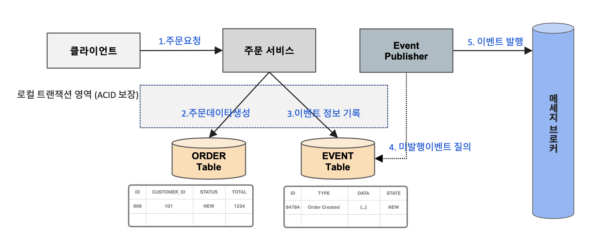

**[ DB 트랜잭션 로그 기반의 이벤트 발행하기 (트랜잭션 로그 테일링 패턴) ]**

트랜잭션 로그 마이너(Transaction log miner)가 이벤트 퍼블리셔의 역할을 담당. DBMS의 트랜잭션 로그의 변경을 감지하여 이벤트 발행

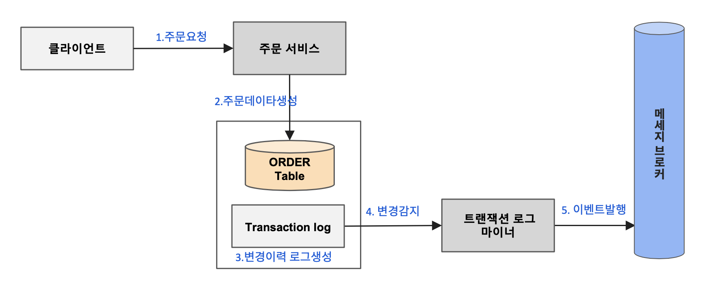

**[ 이벤트 소싱 사용하기 ]**

객체의 상태 변화에 대한 일련의 이벤트를 저장함으로써 이벤트의 발행을 보장하는 방식

비즈니스 개체의 현재 상태를 저장하는 대신 상태를 변경하는 **모든 이벤트 내역을 목록으로 저장**

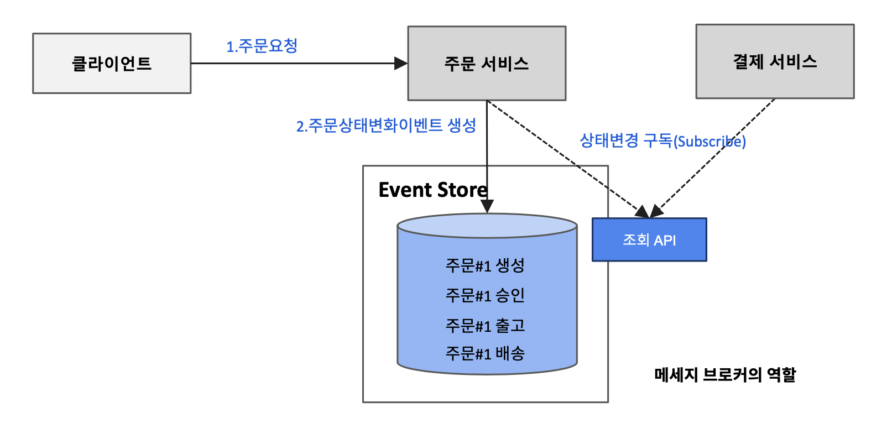

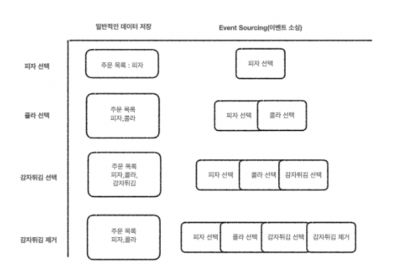

# CQRS Pattern

CQRS 패턴 - Command-Query Responsibility Segregation

- **명령(Command)과 조회(Query) 책임의 분리**를 의미
- 시스템의 읽기 및 쓰기 작업을 명령 모델(업데이트용)과 쿼리 모델(읽기용)의 두 가지 모델로 분리하는 패턴

**Database 분리기반 CQRS**

- 명령 / 조회를 위한 **Database를 분리**하고 별도의 Message Broker를 통해 Data 동기화를 처리하는 방식
- **결과적 일관성(Eventual Consistency)** 을 지원
- 동일 Database 사용에 따른 성능 문제를 해결할 수 있음
- Data 동기화 처리를 위한 **Message Broker 가용성과 신뢰성**이 보장되어야함
- **물리적으로 2개의 데이터베이스를 사용하여 읽기 및 쓰기 데이터베이스를 분리하는 것이 가장 이상적**
- **읽기 집약적인 애플리케이션인 경우 쿼리에 최적화된 사용자 정의 데이터 스키마를 별도로 구성**

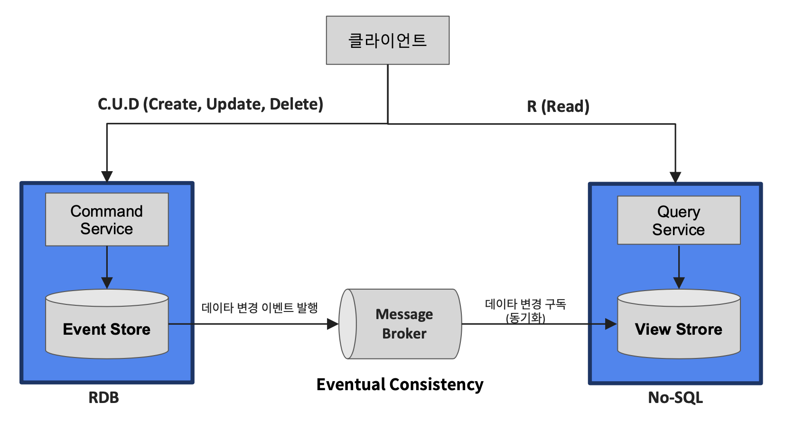

Query Service 에는 No-SQL 을 사용하고, Command Service 에는 관계형 데이터베이스를 사용. 읽기 및 쓰기 데이터베이스 유형에 **서로 다른 데이터베이스를 사용할 수 있음**

# 동기, 비동기 통신

- **서비스간의 통신은 요청과 응답의 즉시성에 따라 동기(syncronous)과 비동기(asynchronous)로 구분**
- 어떤 방식을 선택할 건지는 애플리케이션의 특정 요구 사항, **지연시간(latency)** 과 **확장성(Scalability)** 간의 원하는 절충점에 따라 달라짐
- 빠른 응답을 얻는 것과 시스템이 많은 작업을 처리할 수 있는지 확인하는 것 사이에서 **적절한 균형**을 찾는 것이 중요
- **이벤트 주도 아키텍처에서는 서비스간 모든 통신은 비동기 방식이 적용됨**

## 동기 (Synchronous)

- 작업 - **요청 / 응답**
- **Blocking**
- **titly coupled** - 서비스가 서로 강하게 결합되는 방식
- Request - Response Model
- 예) **결제 서비스, 인증 서비스, 재고 관리 서비스 등**

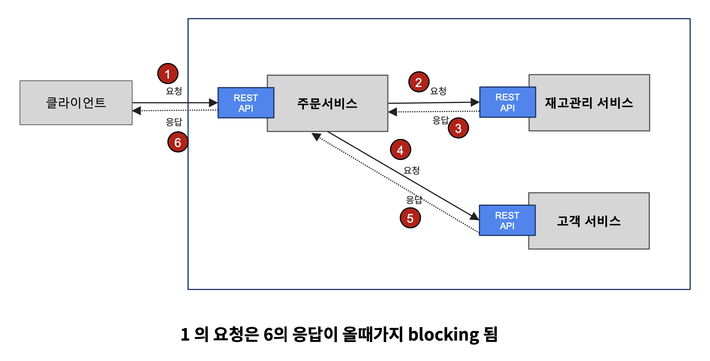

## 비동기(Asynchronous)

- 작업 - **비동기 요청 /  응답, 단방향 알림**
- **Non Blocking**
- **loosly coupled** - 서비스가 서로 느슨하게 결합되는 방식
- Pub - Sub Model
- Message - 메세지, Publish - 발행, Subscribe - 구독
- 예) **이벤트 알림 서비스, 이미지, 파일 프로세싱 등**

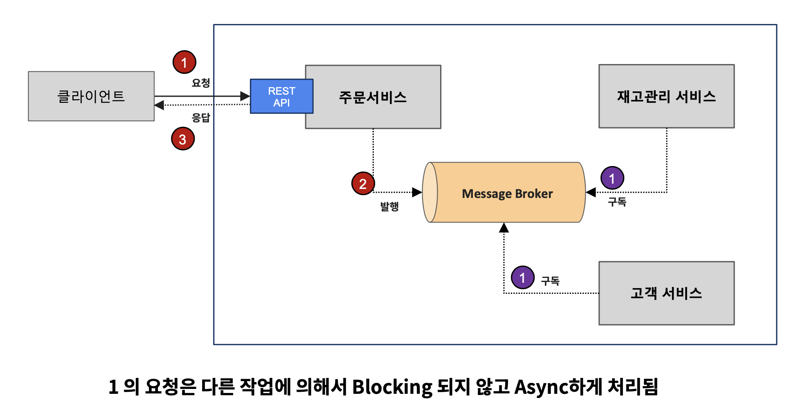