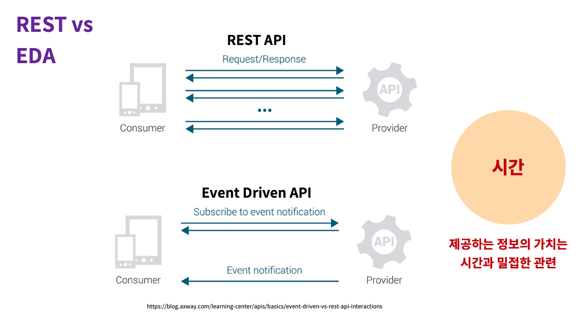
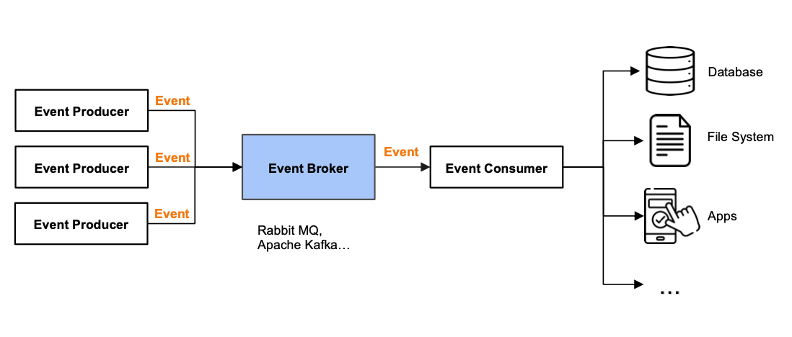

# EDA 개요

## 현대 아키텍처의 경향과 방향성

### 리액티브 선언(Reactive Manifesto)

- 2014년 요나스 보네르 등이 선언한 리액티브 선언문 ([The Reactive Manifesto](https://www.reactivemanifesto.org/))
- 현대 애플리케이션이 갖춰야할 **4가지 속성** 제시
- 이러한 요건을 만족하는 시스템을 **리액티브 시스템**으로 정의

### 리액티브 시스템(Reactive System)

이전의 소프트웨어 아키텍처는 오늘날의 애플리케이션 요구사항에 쉽게 부응하지 못한다. 지금 필요한 아키텍처는 **응답이 잘 되고, 탄력적**이며 **유연**하고 **메시지 기반으로 동작**하는 시스템이다. 우리는 이것을 **리액티브 시스템(Reactive System)** 이라고 부른다.

**응답성(Responsive)**
- 리액티브 시스템은 사용자에게 **신뢰성 있는 빠른 응답을 제공**해야 함을 의미, 서비스 품질의 일관성을 유지하는데 가장 중요한 요소
- 더불어 리액티브 시스템은 유지보수의 **용이성(Maintainable)**, **확장성(Extensible)** 도 제공해야 한다.

**탄력성(Elastic)**
- 리액티브 시스템은 **균일한 응답성의 제공**을 위해 **탄력적**이어야 한다. 탄력적이라 함은 시스템의 사용량에 비례하여 **자원을 유연하게 늘리거나 줄이는 능력**을 뜻한다.

**복원력(Resilient)**
- 리액티브 시스템은 장애가 발생하거나, 부분적으로 고장이 나더라도 전체로 오염(전파)되지 않고(**장애격리**) **빠르게 복구**하는 능력을 갖추어야 한다.

**메세지 기반 (Message Driven)**
- **비동기 메시지 전송(Asynchronous)**, **느슨한 결함(Loosly Coupled),** **논블로킹 통신(Non Blocking)** 등의 특징을 가지도록 해주는 수단 (기술)
- 대표적인 기술들: Project Reactor, Spring Webflux, Message Broker(Kafka..) ..

위 4가지 요소는 모두 **Reactive(반응이 빠른)한** 시스템을 만들기 위한 요소들이고 각 요소들은 상호 보완적이다. 리액티브 시스템의 공통적인 특성은 바로 **아키텍처 유연성(flexibility)** 이다. 급변하는 현재의 비즈니스 환경에 적응할 수 있는 시스템을 요구하는 것으로, 시스템 자체가 언제든지 유연하고 빠르게 대응할 수 있어야 하기 때문이다. 이것이 바로 EDA(Event Driven Architecture)의 등장 배경이 된다.

## EDA 개요 및 주요특징

### EDA?

**Event(Message)** 를 사용하여 **애플리케이션의 데이터 흐름(비즈니스의 처리)을 결정**하고, 애플리케이션간의 **느슨한 결합**을 통해 **아키텍처의** **유연성과 확장성을 확보**하는 현대 아키텍처의 방향성에 부합하는 소프트웨어 설계 패턴

### EDA 주요개념

**느슨한 결합 (Loosly-Coupled)**

- 느슨한 결합은 REST API 와 같은 연동 방식에 비해 EDA의 두드러지는 장점
- API 방식 - 시스템간의 종속성(의존성)을 가지며 적절한 형식의 요청을 전송한 후 응답을 기다려야하는 **동기적 요청-응답모델** (Blocking Request - Response Model)
- **EDA는 시스템간의 요청과 응답이 아닌, 발행(생산)과 구독(소비)의 관계로 시스템간 느슨한 결합이 가능**

**비동기 (Asynchronous)**
- 클라이언트(소비자)는 요청에 대해 즉각적인 응답을 기다리지 않고 **Non Blocking 상태**의 작업이 가능
- 여러 이벤트를 여러 소비자가 동시에 처리할 수 있으므로 시스템에서 많은 양의 이벤트를 효율적으로 처리
- 시스템 자원(Resource)의 **효율적인 사용**과 그에따른 **확장성**, **응답성**을 확보할 수 있음

**분산 (Distibution)**
- **분리된 아키텍처**를 통해 이벤트를 기록, 전송 및 처리하기 위해 구축된 시스템 설계 방식
- **역할**의 분산, **책임**의 분산, **부하**의 분산
- 시스템 구성 요소가 **독립적으로 작동**, 병목 현상과 단일 장애 지점을 최소화
- 필요에 따라 더 많은 이벤트 생산자, 소비자, 프로세서를 추가, 시스템의 **Scale-Out**이 가능
- 기존 시스템을 크게 변경하지 않고도 새로운 기능을 추가할 수 있는 **유연성**이 확보

### EDA 주요특징

**시스템간 상호의존성의 배제**

- **느슨한 결합**이 가능하므로 **분산**시스템, **마이크로서비스**간 연동에 적합
- 상대시스템의 성능, 서버 상태에 전혀 영향을 받지 않는다.
- 서로 시스템 정보를 몰라도 **메세지 브로커**를 통한 시스템간 메세지 교환이 가능
- API 방식의 경우, 목적지 시스템의 성능과 서버의 상태에 직접적인 영향을 받기 때문에 각 시스템의 개별적인 예외처리, FallBack 처리가 필수

**REST API:** 물어봐야지만 응답을 받을 수 있음

**[ Request - Response Model ]**
- Blocking
- Synchronous
- Tightly Coupled

**EDA**: 구독만 하고 있으면 필요한 정보를 물어보지 않고 즉시 받을 수 있음

**[ Publish - Subscribe Model ]**
- Non Blocking
- Asynchronous
- Loosly Coupled

## EDA 구성요소 및 장단점

### EDA 구성요소

**이벤트**

- 이벤트는 시스템에서 발생한 **유의미한 사건, 변화**를 의미
- 발생한 일과 일어난 일에 대한 기록. 이벤트는 임의로 변경하거나 삭제할 수 없는 불변의 기록.
- **사용자 작업,** **시스템 경고** 또는 **애플리케이션에서 작업을 트리거하는 기타 모든 유형**의 이벤트를 의미
- 사용자가 버튼을 클릭하거나 IoT 센서가 판독하거나 시스템 오류가 발생하는 등 간단한 것부터 시작
- 이거머스의 대표적인 이벤트 - **회원가입, 주문완료, 결제완료, 반품요청, 배송완료** 등

**이벤트 생산자 (발행자)**

- 이벤트 생성자(발행자)는 이벤트를 생성할 수 있는 모든 것을 의미
- 대부분의 경우 이벤트 생성자는 **애플리케이션 또는 서비스**

**이벤트 소비자 (구독자)**

- 이벤트 소비자는 어떤 종류의 작업을 수행하기 위해 이벤트를 소비할 수 있는 모든 것을 의미
- **서비스와 애플리케이션** 모두 이벤트 소비자

**이벤트 중개자**

- 이벤트 브로커는 이벤트 생산자와 소비자를 위한 **중개자 역할**을 하는 소프트웨어
- 발행한 이벤트를 **보관**, 적절한 소비자에게 전달될 수 있도록 **라우팅**하는 역할을 담당
- 대표적인 이벤트 브로커 - Rabbit MQ, 카프카 등

### EDA 장점

**확장성**
- 이벤트 중심 아키텍처의 서비스는 서로 **격리**된 구조
- EDA는 구성 요소의 **수평적 확장을 지원(Scale-out)** 하므로 시스템을 크게 재설계하지 않고도 소비자 또는 생산자를 추가하여 증가하는 부가 처리가 가능

**유연성**
- 새로운 이벤트 유형이나 처리 로직 추가와 같은 시스템 변경은 **느슨한 결합(loosly coupled)** 을 기반으로
  기존 컴포넌트에 미치는 영향을 최소화하면서 구현가능

**복원력**
- 이벤트 중심 아키텍처의 시스템 구성 요소는 모두 느슨한 결합으로 독립적으로 구성됨
- 한 서비스에서 장애가 발생하더라도 전체 시스템에 영향이 최소화
- **장애의 격리 및 빠른 복구로 가용성 극대화**
- 시스템 다운타임 최소화 → 전체 시스템의 사용성에 영향을 주지 않고도 **시스템 장애 조치 및 업그레이드 가능**

### **EDA 단점**

**복잡성**
- 이벤트 기반 시스템의 **비동기적 특성과 분산**으로 인해 **구조적, 관리적 복잡성**을 띄게 됨
- 즉, 시스템의 관리포인트 및 디버깅 및 모니터링 비용이 동기식 시스템보다 높아질 수 밖에 없음

**데이터 일관성**
- **여러 서비스에서 데이터 일관성을 보장하는 것은 특히 이벤트가 순서대로 처리되지 않을 수 있는 분산 시스템에서는 매우 어려운 과제**
- 전통적인 DBMS 기반의 환경에서 보장되는 **ACID 속성을 EDA에서는 보장할 수 없음**
- 일반적으로 트랜잭션 ACID를 지원하지 않고 대신 **이벤트 일관성(Event Consistency)을 지원** 하므로 기존 트랜잭션보다 훨신 더 **복잡한 처리**가 요구됨
- EDA와 같은 분산 아키텍처에서의 데이터의 일관성과 트랜잭션을 보장을 위해서는 **이벤트 소싱(Event Sourcing)** 이나 **사가 패턴(Saga Patter)** 등의 별도의 처리기술이 필요