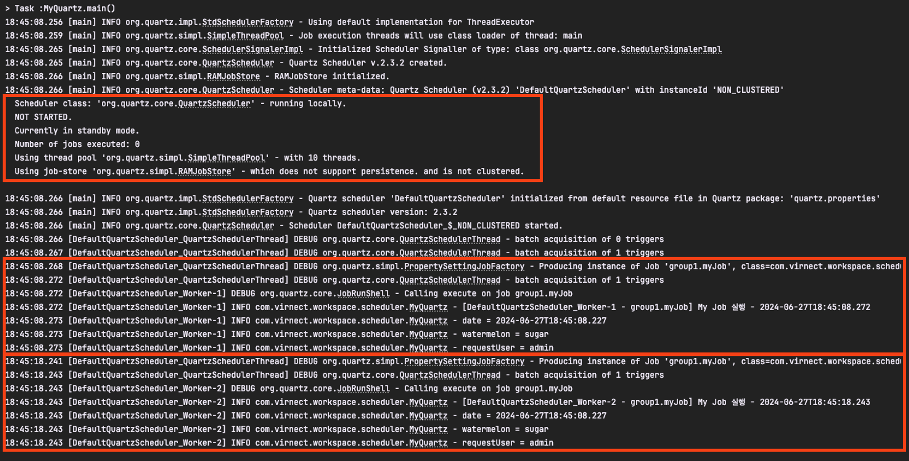

# **Quartz로 Scheduling 해보기**

이전 포스트에서 왜 Quartz Scheduler를 선택했는지, Spring Batch, Spring Scheduler, Quartz Scheduler에 대해 각각 알아보았다. 이번 포스트에서는 Quartz를 이용해 스케줄링 작업을 구현하는 방법과 사용법에 대해 다루도록 하겠다.

**이전 포스트 보러가기 →** [왜 Quartz Scheduler를 선택했을까?](https://conagreen.gitbook.io/til/undefined-1/quartz-scheduler/step1)

## Quartz  주요 인터페이스

- **Job** - 실제 수행할 작업을 정의하는 인터페이스
- **JobDetail** - Job 클래스의 인스턴스와 Job 실행에 필요한 추가 정보를 포함하는 인터페이스
- **Trigger** - Job 실행을 스케줄링하기 위한 인터페이스 (Job : Trigger = 1 : N)
    - SimpleTrigger - 지정된 시간 간격으로 Job 실행
    - CronTrigger - Cron 표현식으로 Job을 스케줄링
- **Scheduler** - Job 실행과 Trigger 스케줄링을 관리하는 인터페이스
- **Listener** - 주로 프로세스의 실행, 종료, 중단 등의 라이프 사이클에 따라 로그를 출력하거나 추가 로직을 작성할 수 있는 객체
    - 선택사항으로 설정하지 않아도 실행하는데 문제 없음
    - ScheduleListener, TriggerListener, JobListener

### 1. Job

- 실행할 작업을 정의하는 인터페이스
- Job 인터페이스를 구현하여 실행하고자 하는 작업을 정의할 수 있으며, 트리거에 의해 자동으로 실행

```java
// Job 인터페이스를 구현하여 execute 메소드에 수행 로직 작성

@Slf4j
public class MyJob implements Job {
	@Override
	public void execute(JobExecutionContext context) {
		log.info("[{} - {}] Job 실행 - {}", Thread.currentThread().getName(), context.getJobDetail().getKey(), LocalDateTime.now());
	}
}
```

### 2. Trigger

- Job을 실행시키는 조건을 정의하는 인터페이스
- Job을 특정 시간에 실행하거나 주기적으로 실행하도록 설정 할 수 있다.

**[ SimpleTrigger ]**

일정 간격으로 주기적으로 실행되는 트리거

- repeatCount - 음이 아닌 정수 값으로 작업이 실행될 횟수를 지정하며, 0이 입력되면 무한히 실행
- repeatInterval - 작업이 실행되는 간격을 지정

```java
// 트리거 설정 예시 (즉시 시작 / 10초 간격으로 실행 / 무한 반복)
SimpleTrigger trigger = TriggerBuilder.newTrigger()
		    .withIdentity("intervalTrigger", "group1")
		    .startNow()
		    .withSchedule(SimpleScheduleBuilder.simpleSchedule()
		            .withIntervalInSeconds(10)
		            .repeatForever())
		    .build();
```

**[ CronTrigger ]**

Cron 표현식을 사용하여 지정된 시간에 작업 실행

- cronExpression - Cron 표현식을 나타내는 문자열로, 이 표현식은 CronTrigger가 실행될 시간을 정의
- timeZone - CronTrigger의 타임존을 설정할 수 있으며, 해당 속성을 설정하지 않으면 서버의 타임존이 기본값으로 설정

```java
// 트리거 설정 예시 (한국 시간 기준으로 매일 자정에 실행)
CronTrigger cronTrigger = TriggerBuilder.newTrigger()
			.withIdentity("cronTrigger", "group1")
			.withSchedule(CronScheduleBuilder.cronSchedule("0 0 0 * * ?").inTimeZone(TimeZone.getTimeZone("Asia/Seoul")))
			.build();
```

### 3. Scheduler

Job과 Trigger를 연결하고, Job을 실행시키는 역할을 수행

```java
// Scheduler 인터페이스의 scheduleJob() 메소드
// 스케줄링하기 위한 JobDetail과 Trigger 객체를 인자로 받는다.
java.util.Date scheduleJob(org.quartz.JobDetail jobDetail, org.quartz.Trigger trigger) throws org.quartz.SchedulerException;
```

## 시작하기

Quartz Scheduler를 사용하기 위해서는 먼저 해당 라이브러리의 의존성을 추가해야한다.

```java
implementation 'org.springframework.boot:spring-boot-starter-quartz'
```

### 전체 코드

```java
@Slf4j
public class MyQuartz {
	public static void main(String[] args) throws SchedulerException {
		JobDataMap jobDataMap = new JobDataMap();
		jobDataMap.put("watermelon", "sugar");
		jobDataMap.put("requestUser", "admin");
		jobDataMap.put("date", LocalDateTime.now());

		JobDetail jobDetail = JobBuilder.newJob(MyJob.class)
			.withIdentity("myJob", "group1")
			.setJobData(jobDataMap)
			.build();

		Trigger trigger = TriggerBuilder.newTrigger()
			.withIdentity("cronTrigger", "group1")
			.startNow()
			.withSchedule(SimpleScheduleBuilder.simpleSchedule()
				.withIntervalInSeconds(10)
				.repeatForever())
			.build();

		Scheduler scheduler = new StdSchedulerFactory().getScheduler();
		scheduler.start();
		scheduler.scheduleJob(jobDetail, trigger);
	}

	public static class MyJob implements Job {
		@Override
		public void execute(JobExecutionContext context) {
			log.info("[{} - {}] My Job 실행 - {}", Thread.currentThread().getName(), context.getJobDetail().getKey(), LocalDateTime.now());
			JobDataMap jobDataMap = context.getJobDetail().getJobDataMap();
			for (Map.Entry<String, Object> jobData : jobDataMap.entrySet()) {
				log.info("{} = {}", jobData.getKey(), jobData.getValue());
			}
		}
	}
}
```

위의 코드를 실행하면 아래와 같이 로그가 출력된다. 첫 번째 빨간 박스부터 분석해보겠다

1. `Using thread pool 'org.quartz.simpl.SimpleThreadPool' - with 10 threads.`
- ThreadPool에 대한 설정을 할 수 있지만, 하지 않으면 기본값으로 제공된다. 현재는 따로 설정을 하지 않았기 때문에 10개로 설정되어 있다.
1. `Using job-store 'org.quartz.simpl.RAMJobStore' - which does not support persistence. and is not clustered.`
- JobStore 타입 역시 별다른 설정을 하지 않았기 때문에 기본 타입인 `RAMJobStore`로 설정되어 있다.
    - RAM JobStore: Scheduler Data를 메모리에 저장
    - JDBC JobStore: Scheduler Data를 DB에 저장
- JDBC 타입으로 설정하면 DB를 사용하기 때문에 추가로 테이블이 필요하며, 테이블 생성 쿼리는 라이브러리에 포함되어 있다. (JDBC 타입에 대한 자세한 내용은 다음 포스트에서 다룸)
- 추가로 주목해야 할 부분은 `and is not clustered.`이다. 이 부분에서 알 수 있듯 클러스터링 모드가 꺼져 있다. Quartz Scheduler는 클러스터링 지원이 가능하며, 간단한 추가 설정을 통해 이를 활성화할 수 있다. (해당 내용 역시 다음 포스트에서 자세히 다룰 예정)

두 번째, 세 번째 박스에서 확인할 수 있듯 10초마다 Job의 로직이 실행되는 것을 알 수 있다.



내용이 길어져서 이번 포스트에서는 Quartz의 기본 사용법만 다루고, 다음 포스트에서 더 심화된 내용을 다루도록 하겠다.

다음 포스트에서 다룰 내용:

1. JDBC JobStore 타입으로 스케줄링하기
2. Quartz Scheduler 클러스터링 구성
3. Listener를 이용하여 스프링 배치의 Step 기능 구현하기

